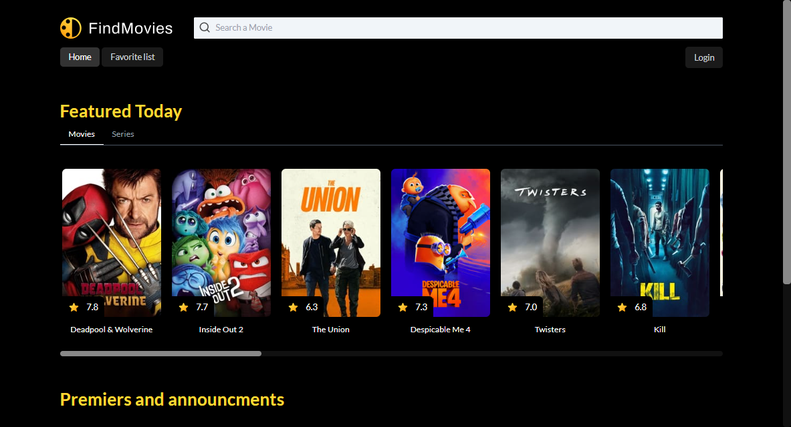
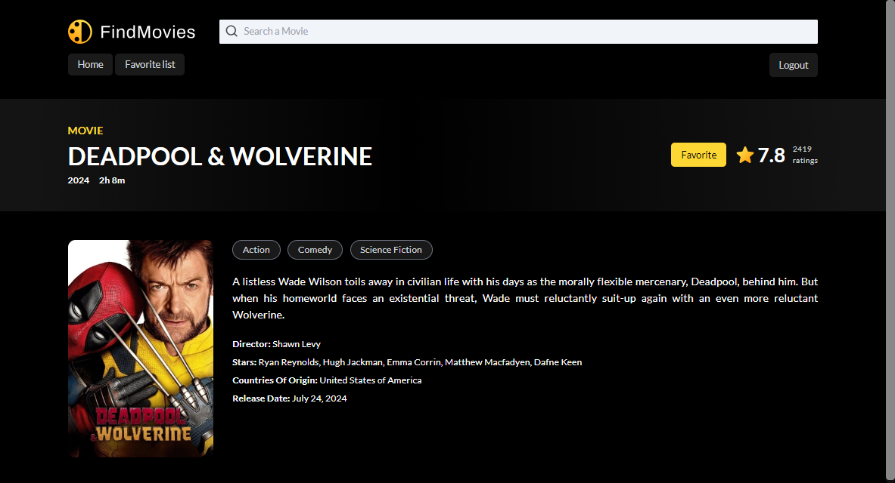
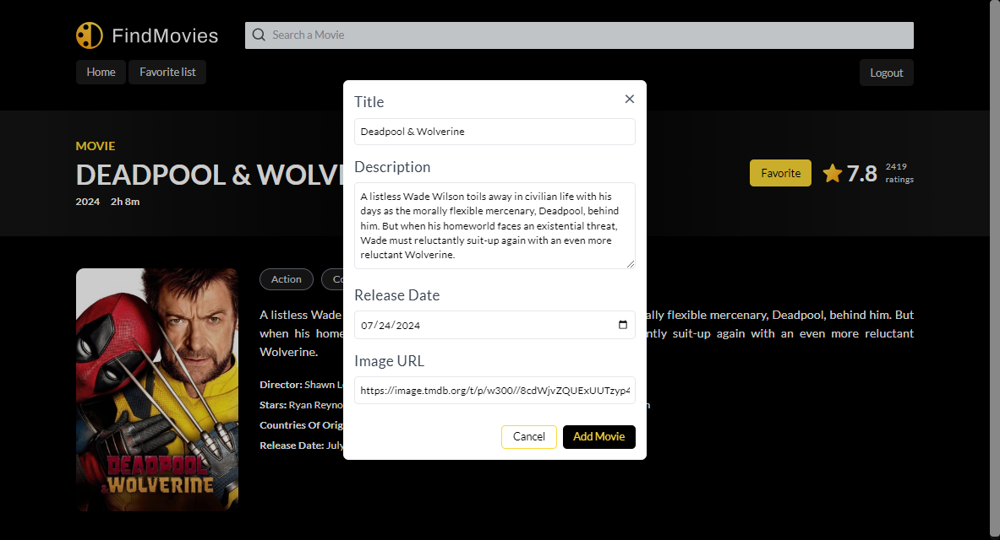
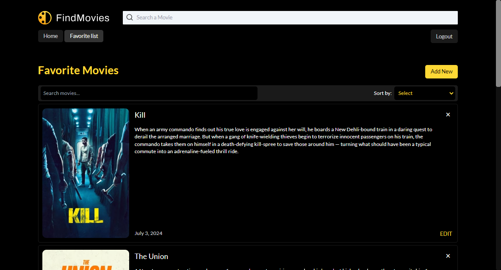

# Favorite Movies App

The Favorite Movies Application is a movie browsing and management platform. It leverages the power of React for a dynamic and responsive frontend and NestJS for a robust backend.

- **Frontend**: React / TypeScript / TailwindCSS
- **Backend**: Node.js / NestJS / TypeORM
- **Database**: PostgreSQL
- **Movies API**: [TMDB](https://www.themoviedb.org/)

## Overview

## Features

- **Movie Browsing**: Browse a library of movies using the TMDB API.
- **Infinite Scroll**: Continuous browsing with infinite scrolling.
- **Authentication**: User authentication to manage personal movie list.
- **Favorite List**: Create, view and manage a list of favorite movies.
- **Backend Integration**: Backend built with NestJS ensures smooth data handling.

## Installation

### Backend Setup

1. **Clone the repository:**

   `git clone https://github.com/deivydaskim/fav-movies.git`

2. **Navigate to the backend directory:**

   `cd fav-movies/backend`

3. **Install backend dependencies:**

   `npm install`

4. **Setup PostgreSQL database:**

   - Create a new PostgreSQL database.
   - Create a `.env` file based on `.env.example` with your database credentials.

5. **Start the backend server:**

   `npm run start`

### Frontend Setup

1. **Navigate to the frontend directory:**

   `cd ../frontend`

2. **Install frontend dependencies:**

   `npm install`

3. **Create a `.env` file:**

   - Create a `.env` file based on `.env.example` with your TMDB API access token.

4. **Start the frontend server:**

   `npm run dev`

## Access the Application

- **Client:** [http://localhost:5173](http://localhost:5173)
- **Backend API Documentation:** [http://localhost:3000/api](http://localhost:3000/api)
